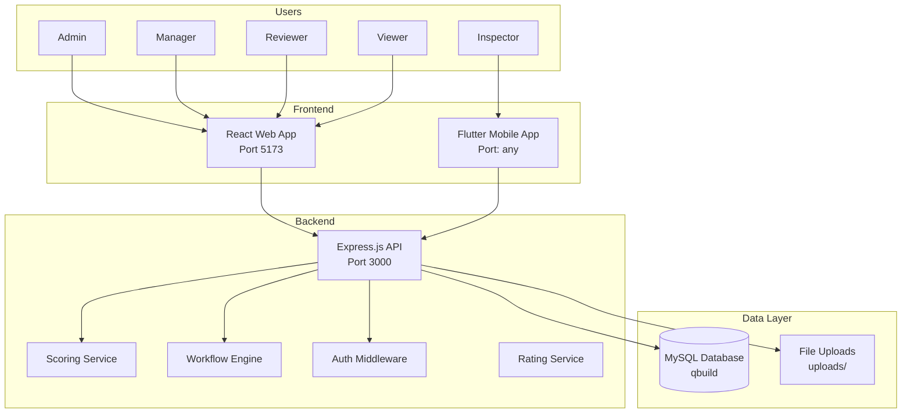
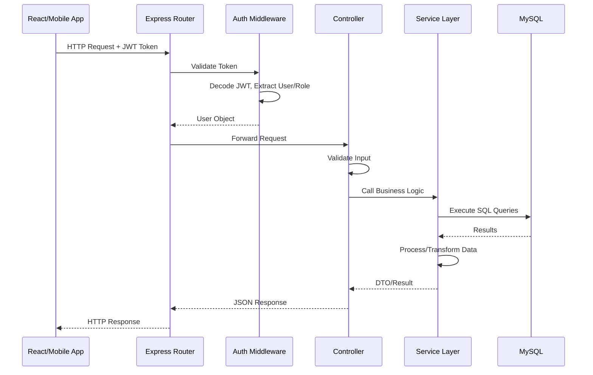
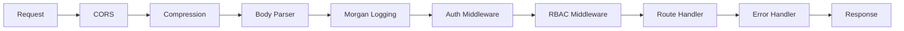
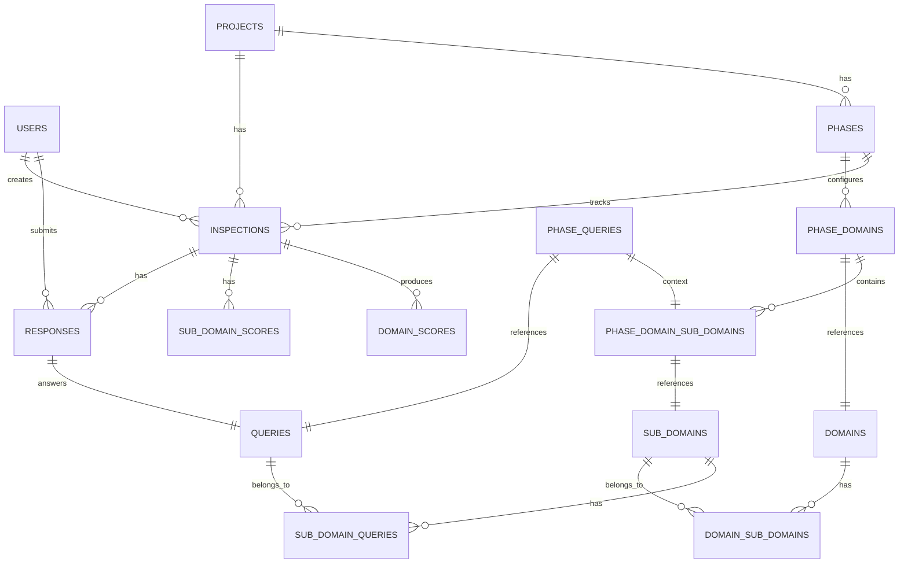
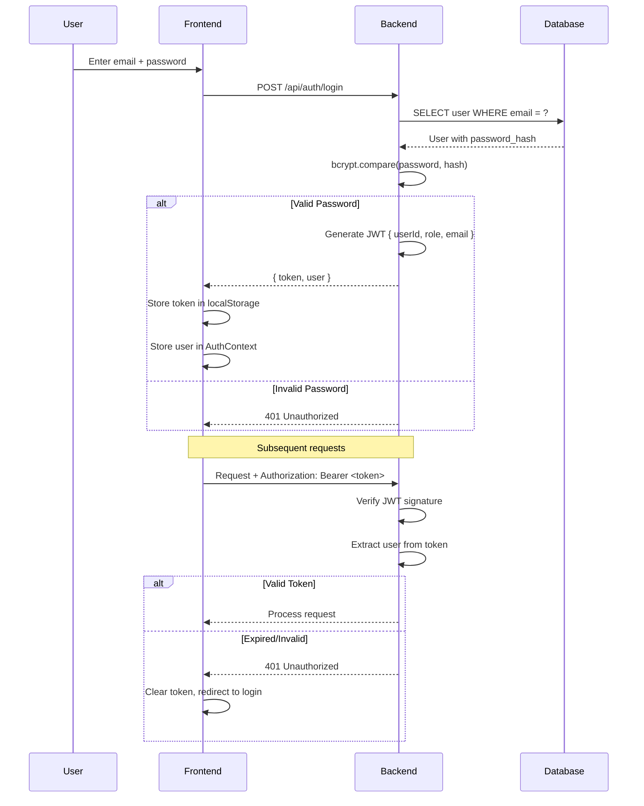
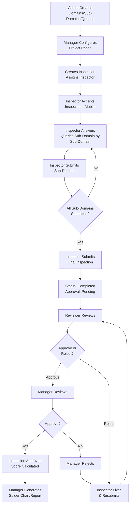
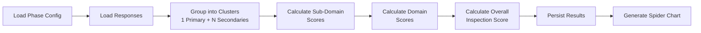

# QBuild / QRating — Complete Architecture Analysis & Learning Guide

> **Author:** Senior Software Architect Analysis  
> **Project:** QBuild — Quality Rating & Inspection Management System  
> **Tech Stack:** Node.js / Express / MySQL / React / Vite / Flutter

---

## TABLE OF CONTENTS

1. [Project Overview & Architecture Diagrams](#1-project-overview)
2. [Backend Architecture Deep Dive](#2-backend-architecture)
3. [Frontend Architecture (Web)](#3-frontend-architecture-web)
4. [Mobile Architecture (Flutter)](#4-mobile-architecture-flutter)
5. [Database Schema & Data Flow](#5-database-schema)
6. [Authentication & Authorization](#6-authentication--authorization)
7. [Business Workflows](#7-business-workflows)
8. [Scoring Engine](#8-scoring-engine)
9. [API Reference & Patterns](#9-api-reference)
10. [Design Patterns Used](#10-design-patterns)
11. [Security Architecture](#11-security-architecture)
12. [Performance Analysis](#12-performance-analysis)
13. [Interview Preparation](#13-interview-preparation)
14. [Learning Roadmap](#14-learning-roadmap)

---

## 1. PROJECT OVERVIEW

### What is QBuild?

QBuild is a **Quality Rating and Inspection Management System** — an enterprise application that enables construction/manufacturing companies to:

1. **Define inspection criteria** (Domains → Sub-Domains → Queries with YES/NO/NA responses)
2. **Assign inspections** to field inspectors with defined phases
3. **Collect inspection data** via mobile app (offline-capable Flutter app)
4. **Review & approve/reject** inspection results by reviewers
5. **Calculate scores** using weighted scoring with spider chart visualizations
6. **Track quality metrics** across projects and phases over time

### Business Domain

```
Construction Quality Assurance / Manufacturing Quality Control
├── Project = Building/Site being inspected
├── Phase = Stage of construction (Foundation, Structure, Finishing)
├── Domain = Quality category (Safety, Electrical, Plumbing)
├── Sub-Domain = Sub-category within domain
├── Query = Individual inspection question (YES/NO/NA)
│   ├── Primary = Main question (3 marks)
│   └── Secondary = Linked follow-up question (1 mark)
└── Inspection = Collection of responses for a phase
```

---

### Architecture Diagram (Context Level)



### Request Lifecycle



---

## 2. BACKEND ARCHITECTURE

### Directory Structure

```
backend/
├── src/
│   ├── app.js                    # Express app setup & middleware
│   ├── config/
│   │   └── db.js                 # MySQL connection pool + schema migration
│   ├── controllers/              # HTTP handlers (thin layer)
│   │   ├── authController.js     # Login/Register
│   │   ├── project.controller.js # CRUD projects
│   │   ├── domain.controller.js  # CRUD domains
│   │   ├── sub_domain.controller.js
│   │   ├── query.controller.js   # CRUD queries
│   │   ├── response.controller.js# Submit/override responses
│   │   ├── scoring.controller.js # Score calculation + chart data
│   │   ├── mobile.controller.js  # Mobile-specific endpoints
│   │   ├── reviewer.controller.js# Reviewer operations
│   │   └── manager.controller.js # Manager operations
│   ├── middleware/
│   │   ├── auth.js               # JWT verification
│   │   ├── rbac.js               # Role-based access control
│   │   ├── validation.js         # Input validation
│   │   └── errorHandler.js       # Global error handling
│   ├── services/
│   │   ├── scoring.service.js    # ** KEY ** Rating engine
│   │   ├── reviewService.js      # Review workflow logic
│   │   ├── response.service.js   # Response submission + cascading
│   │   └── domain/               # Reference architecture examples
│   ├── repositories/             # Data access layer (reference)
│   ├── routes/                   # Express route definitions
│   ├── workflow/                 # Workflow state machine
│   └── utils/                    # Logging, helpers
└── database/                     # SQL migration files
```

### Architecture Pattern: Layered Architecture (Monolith)

```
┌────────────────────────────────────────────┐
│              Routes (thin)                 │
│         GET/POST/PUT/DELETE mapping        │
├────────────────────────────────────────────┤
│          Controllers (thin)                │
│   Parse request → Validate → Call Service  │
├────────────────────────────────────────────┤
│   ┌───────────┐  ┌──────────────────────┐  │
│   │  Services  │  │   Workflow Engine    │  │
│   │ Business   │  │   State Machine      │  │
│   │ Logic      │  │   Score Calculation  │  │
│   └─────┬─────┘  └──────────────────────┘  │
│         │                                  │
│   ┌─────▼─────┐                            │
│   │    DB      │  (Direct SQL queries)      │
│   └───────────┘                            │
└────────────────────────────────────────────┘
```

### Key Design Decision: No ORM

The project uses **raw SQL with mysql2** instead of an ORM like Sequelize/TypeORM.

**Why this was chosen:**
- Full control over SQL queries
- Better performance for complex joins and aggregations
- No ORM overhead for the scoring engine
- The schema evolved rapidly and raw SQL was more flexible

**Trade-offs:**
- More boilerplate code for CRUD
- No automatic migration generation
- SQL injection prevention must be manually ensured (parameterized queries are used)
- No model validation at the database layer

### Middleware Pipeline (Express)



### Database Connection: Custom Connection Pool

File: `backend/src/config/db.js`

```
Class DatabaseConnection
├── Pool: mysql2.createPool()
├── initialize() → Create pool + test connection
├── execute(sql, params) → Run query with parameterized values
├── executeOne(sql, params) → Get first row
├── transaction(callback) → Run queries in transaction
└── ensureSchema() → Auto-migrate tables/columns
```

**Key Feature: Auto Schema Migration**
The `ensureSchema()` method runs on startup and:
1. Checks if tables/columns exist
2. Adds missing columns
3. Creates missing tables
4. This means the schema is "self-healing" — no manual migrations needed

---

## 3. FRONTEND ARCHITECTURE (WEB)

### Tech Stack

| Technology | Purpose |
|-----------|---------|
| **React 18** | UI framework |
| **Vite 4** | Build tool (fast HMR) |
| **React Router 6** | Client-side routing |
| **Recharts** | Spider chart / Radar chart |
| **React-Toastify** | Toast notifications |
| **Axios** | HTTP client (interceptors) |
| **Context API** | State management (Auth) |
| **Tailwind CSS** | Utility CSS framework |
| **Lucide React** | SVG icons |

### Component Hierarchy

```
App
├── AuthProvider (Context)
└── AppRoutes
    ├── /login → Login
    └── Layout (Protected)
        ├── Sidebar (Role-based)
        ├── Dashboard
        ├── Projects
        ├── ProjectDetails
        │   ├── PhaseManagementModal
        │   │   ├── PhaseManagement
        │   │   └── CreateInspectionForm
        │   │       └── QueryManagementModal
        ├── Domains
        ├── SubDomains
        ├── Queries
        ├── Reports
        ├── ScoreDashboard
        ├── UserManagement
        ├── ReviewerDashboard
        ├── ReviewerInspectionReview
        ├── ManagerDashboard
        └── ManagerInspectionReview
```

### Routing & Access Control

| Route | Admin | Manager | Reviewer | Inspector | Viewer |
|-------|-------|---------|----------|-----------|--------|
| `/dashboard` | ✅ | ✅ | ✅ | ✅ | ✅ |
| `/projects` | ✅ | ✅ | ❌ | ❌ | ❌ |
| `/domains` | ✅ | ✅ (read) | ❌ | ❌ | ❌ |
| `/sub-domains` | ✅ | ✅ (read) | ❌ | ❌ | ❌ |
| `/queries` | ✅ | ✅ (read) | ❌ | ❌ | ❌ |
| `/reports` | ✅ | ❌ | ❌ | ❌ | ❌ |
| `/score-dashboard` | ✅ | ❌ | ❌ | ❌ | ❌ |
| `/users` | ✅ | ❌ | ❌ | ❌ | ❌ |
| `/reviewer-dashboard` | ❌ | ❌ | ✅ | ❌ | ❌ |
| `/manager-dashboard` | ❌ | ✅ | ❌ | ❌ | ❌ |

### State Management Pattern

The project uses **React Context** for global auth state and **local state (useState)** for component-specific data.

```jsx
// Auth Context Pattern
const AuthContext = createContext();

function AuthProvider({ children }) {
  const [user, setUser] = useState(null);
  
  const login = async (credentials) => {
    const response = await api.post('/auth/login', credentials);
    localStorage.setItem('token', response.token);
    setUser(response.user);
  };
  
  return (
    <AuthContext.Provider value={{ user, login, logout, isManager, isReviewer }}>
      {children}
    </AuthContext.Provider>
  );
}
```

### API Integration Layer

File: `QBuild-Web/src/services/api.js`

Uses **Axios instance with interceptors**:

```jsx
const api = axios.create({
  baseURL: 'http://localhost:3000/api',
  timeout: 10000,
  headers: { 'Content-Type': 'application/json' }
});

// Request interceptor: attach JWT token
api.interceptors.request.use(config => {
  const token = localStorage.getItem('token');
  if (token) config.headers.Authorization = `Bearer ${token}`;
  return config;
});

// Response interceptor: unwrap data, handle 401
api.interceptors.response.use(
  response => response.data,
  error => {
    if (error.response?.status === 401) {
      localStorage.removeItem('token');
      window.location = '/login';
    }
    return Promise.reject(error);
  }
);
```

### Service Pattern

```jsx
// Organized by domain
export const domainApi = {
  getAll: () => api.get('/domains'),
  getById: (id) => api.get(`/domains/${id}`),
  create: (data) => api.post('/domains', data),
  update: (id, data) => api.put(`/domains/${id}`, data),
  delete: (id) => api.delete(`/domains/${id}`),
  getSubDomains: (id) => api.get(`/weightage-management/domain-sub-domains/${id}`)
};
```

---

## 4. MOBILE ARCHITECTURE (FLUTTER)

### Tech Stack

| Technology | Purpose |
|-----------|---------|
| **Flutter 3** | Cross-platform mobile framework |
| **Provider** | State management |
| **GoRouter** | Declarative routing |
| **Image Picker** | Camera/gallery access |
| **Local Cache** | Offline support |

### Mobile Screens

```
MobileApp
├── LoginScreen
├── DashboardScreen
│   ├── Stats cards (inbox, active, completed)
│   ├── Active inspections tab
│   └── History tab
├── InboxScreen
│   ├── Search
│   └── Inspection cards (accept button)
├── RejectedInboxScreen
├── DomainsScreen (per inspection)
│   └── Sub-domain list with submit status
└── InspectionQueriesScreen
    ├── YES/NO/NA buttons
    ├── Photo capture
    ├── NC type selection
    └── Comments text field
```

### Mobile-Specific API

File: `backend/src/controllers/mobile.controller.js`

| Endpoint | Method | Purpose |
|----------|--------|---------|
| `/api/mobile/dashboard` | GET | Stats + active/history inspections |
| `/api/mobile/inbox` | GET | Pending inspections |
| `/api/mobile/inspections/:id/accept` | POST | Accept inspection |
| `/api/mobile/inspections/:id/domains` | GET | Get domains with sub-domains |
| `/api/mobile/inspections/:id/domains/:domainId/subdomains/:subDomainId/queries` | GET | Get queries with existing responses |
| `/api/mobile/inspections/:id/queries/:queryId/response` | POST | Submit single response |
| `/api/mobile/inspections/:id/subdomains/:subDomainId/submit` | POST | Submit entire sub-domain |
| `/api/mobile/inspections/:id/submit` | POST | Final inspection submission |

### Offline-First Design Considerations

The mobile app can:
1. **Cache inspection data locally** using `LocalCacheService`
2. **Accumulate responses** across sub-domains
3. **Submit in batches** when online
4. **Handle cascading NA responses** automatically when primary is NO/NA

---

## 5. DATABASE SCHEMA

### Entity Relationship Diagram



### Key Tables & Purpose

| Table | Purpose | Key Columns |
|-------|---------|-------------|
| `users` | Authentication & roles | id, email, password_hash, role |
| `domains` | Quality categories (e.g., Safety) | id, domain_name, is_active |
| `sub_domains` | Sub-categories within domains | id, sub_domain_name |
| `domain_sub_domains` | Many-to-many mapping + weightage | domain_id, sub_domain_id, weightage |
| `queries` | Individual inspection questions | id, question_text |
| `sub_domain_queries` | Links queries to sub-domains + type (primary/secondary) + parent | id, sub_domain_id, query_id, query_type, parent_id |
| `projects` | Construction/manufacturing projects | id, project_name, status |
| `phases` | Project phases/stages | id, project_id, phase_number, status |
| `phase_domains` | Domain weightage per phase | project_id, phase_number, domain_id, weightage |
| `phase_domain_sub_domains` | Sub-domain weightage per phase | domain_id, sub_domain_id, weightage |
| `phase_queries` | Queries assigned per phase | project_id, phase_number, query_id |
| `inspections` | Inspection records | id, project_id, phase, status, inspector_id |
| `responses` | YES/NO/NA answers to queries | inspection_id, query_id, response, domain_id, sub_domain_id |
| `sub_domain_scores` | Cached sub-domain scores | inspection_id, sub_domain_id, domain_id, secured_points, max_points |
| `domain_scores` | Cached domain scores | inspection_id, domain_id, percentage |
| `inspection_subdomain_submissions` | Track submitted sub-domains | inspection_id, sub_domain_id, domain_id |

### Important Schema Notes

1. **`responses` table has a composite unique key**: `(inspection_id, query_id, domain_id)` — this allows the same query to be used in different domains
2. **`sub_domain_scores` includes `domain_id`**: Distinguishes scores when same sub-domain exists in different domains  
3. **`phase_domain_sub_domains` has `is_manual` flag**: Tracks if weightage was manually set vs auto-calculated
4. **All tables use InnoDB**: For transaction support and foreign key enforcement

### Indexing Recommendations

| Table | Recommended Index | Reason |
|-------|-------------------|--------|
| `responses` | `(inspection_id, domain_id, query_id)` | Core lookup for scoring |
| `responses` | `(inspection_id, sub_domain_id)` | Sub-domain score calculation |
| `phase_queries` | `(project_id, phase_number, domain_id, sub_domain_id)` | Query loading |
| `sub_domain_scores` | `(inspection_id, sub_domain_id, domain_id)` | Score retrieval |
| `inspections` | `(project_id, phase)` | Inspection lookup per phase |

---

## 6. AUTHENTICATION & AUTHORIZATION

### JWT Authentication Flow



### Role-Based Access Control (RBAC)

```javascript
// backend/src/middleware/rbac.js
const rbacMiddleware = (allowedRoles) => {
  return (req, res, next) => {
    if (!allowedRoles.includes(req.user.role)) {
      return res.status(403).json({ 
        success: false, 
        message: 'Forbidden: insufficient permissions' 
      });
    }
    next();
  };
};

// Usage in routes
router.post('/projects', 
  authMiddleware, 
  rbacMiddleware(['admin', 'manager']), 
  projectController.create
);
```

### Current Role Hierarchy

```
Global Admin (is_global_admin=1)
├── Full CRUD on everything
├── User management
├── Override responses
└── Score recalculation

Manager
├── Approve inspections (manager-level)
├── View projects
├── Read-only library access (domains, sub-domains, queries)
└── Edit project configuration

Reviewer
├── Review submitted inspections
├── Approve/reject at query/sub-domain/domain/global level
└── View assigned inspections

Inspector
├── Conduct inspections (mobile)
├── Submit YES/NO/NA responses
├── Capture photos
└── View own inspections

Viewer
├── Read-only dashboard
└── View inspection results
```

---

## 7. BUSINESS WORKFLOWS

### Complete Inspection Lifecycle



### Scoring Flow



### Response Cascading Rule

When a Primary query's response is **NO** or **NA**, all its linked Secondary queries are automatically set to **NA**:

```
Cluster Example:
├── Primary: "Is the foundation level?" → NO
│   ├── Secondary: "What is the deviation?" → Auto-marked NA
│   └── Secondary: "Is rework required?" → Auto-marked NA

Scoring Impact:
├── Primary NO → Entire cluster: 0 earned marks (but max marks still count)
├── Primary NA → Entire cluster excluded: 0 earned, 0 max
├── Secondary NA → Just that secondary excluded from max (no penalty)
└── Secondary NO → -1 earned mark (but counts in max)
```

---

## 8. SCORING ENGINE

This is the most complex and critical component.

### Scoring Formula

```
Inspection Score = Σ (Domain Score × Domain Weight)
Domain Score = Σ (Sub-Domain Score × Sub-Domain Weight)

Sub-Domain Score = (Earned Marks / Max Marks) × 100%

Where:
- Each cluster = 1 Primary + linked Secondaries
- Primary YES = +1 earned, +1 max
- Primary NO = 0 earned, +1 max (cluster fails)
- Primary NA = 0 earned, 0 max (excluded)
- Secondary YES = +1 earned, +1 max
- Secondary NO = 0 earned, +1 max
- Secondary NA = 0 earned, 0 max (excluded)
```

### Implementation in Code

File: `backend/src/services/scoring.service.js`

```javascript
class ScoringService {
  async calculateInspectionScore(inspectionId) {
    // 1. Load configuration
    const domainWeightages = await this.loadDomainWeightages(projectId, phase);
    const subDomainWeightages = await this.loadSubDomainWeightages(projectId, phase);
    
    // 2. Load data
    const queryClusters = await this.loadQueryClusters(projectId, phase);
    const responses = await this.loadResponses(inspectionId);
    
    // 3. Calculate
    const subDomainResults = this.calculateAllSubDomainScores(...);
    const domainResults = this.calculateAllDomainScores(...);
    const inspectionScore = this.calculateInspectionOverallScore(...);
    
    // 4. Persist
    await this.persistScores(inspectionId, subDomainResults, domainResults);
    
    return result;
  }
}
```

### Key Bug Fixed (Domain-Aware Keys)

**The Problem:** When the same sub-domain exists in multiple domains (e.g., sub_domain_id=5 in both domain_id=1 and domain_id=2), the responseMap key was `"subDomainId:queryId"` which caused one domain's responses to overwrite the other.

**The Fix:** All keys now include `domainId`:
- `responseMap` key: `"${domainId}:${subDomainId}:${queryId}"`
- `queryClusters` key: `"${domainId}:${subDomainId}"`
- Database unique keys include `domain_id`

---

## 9. API REFERENCE

### Standard Response Format

```json
// Success
{
  "success": true,
  "data": { ... },
  "message": "Optional message"
}

// Error
{
  "success": false,
  "message": "Error description",
  "error": { "code": "ERROR_CODE", "details": {} }
}
```

### Core Endpoints

| Method | Endpoint | Auth | Description |
|--------|----------|------|-------------|
| POST | `/api/auth/login` | No | Login, returns JWT |
| GET | `/api/users` | Admin | List all users |
| GET | `/api/projects` | Auth | List projects |
| GET | `/api/projects/:id/phases` | Auth | List project phases |
| POST | `/api/projects/:id/phases` | Admin/Manager | Create new phase |
| PUT | `/api/projects/:id/phases/:phase` | Admin/Manager | Update phase |
| GET | `/api/projects/:id/phases/:phase/configuration` | Auth | Get phase config |
| GET | `/api/domains` | Auth | List domains |
| POST | `/api/domains` | Admin | Create domain |
| GET | `/api/sub_domains` | Auth | List sub-domains |
| POST | `/api/sub_domains` | Admin | Create sub-domain |
| GET | `/api/queries` | Auth | List queries |
| POST | `/api/queries` | Admin | Create query |
| GET | `/api/scoring/:inspectionId/calculate` | Auth | Calculate score |
| GET | `/api/scoring/:inspectionId/spider-chart` | Auth | Get chart data |
| GET | `/api/projects/:id/spider-chart` | Auth | Project spider chart |
| GET | `/api/projects/:id/domains/:domainId/spider-chart` | Auth | Domain spider chart |

### Mobile Endpoints

| Method | Endpoint | Description |
|--------|----------|-------------|
| GET | `/api/mobile/dashboard` | Inspector dashboard |
| GET | `/api/mobile/inbox` | Pending inspections |
| POST | `/api/mobile/inspections/:id/accept` | Accept inspection |
| GET | `/api/mobile/inspections/:id/domains` | Get domains for inspection |
| GET | `/api/mobile/inspections/:id/domains/:domainId/subdomains/:subDomainId/queries` | Get queries with responses |
| POST | `/api/mobile/inspections/:id/queries/:queryId/response` | Submit single response |
| POST | `/api/mobile/inspections/:id/subdomains/:subDomainId/submit` | Submit sub-domain |
| POST | `/api/mobile/inspections/:id/submit` | Final submission |

---

## 10. DESIGN PATTERNS

### 1. Layered Architecture (Monolith)

The backend follows a classic layered architecture:

```
Routes → Controllers → Services → Database
```

Each layer has a single responsibility:
- **Routes**: URL mapping and HTTP method binding
- **Controllers**: Request parsing, validation, response formatting
- **Services**: Business logic, calculations, orchestration
- **Database**: Direct SQL execution via connection pool

### 2. Repository Pattern (Reference Implementation)

File: `backend/src/repositories/index.js`

The repository pattern is demonstrated but not fully adopted yet. The `BaseRepository` provides:

```javascript
class BaseRepository {
  async findById(id)
  async findAll(filters, pagination)
  async create(data)
  async update(id, data)
  async delete(id)
  async count(filters)
  async exists(id)
}
```

**Current Status:** Most services bypass repositories and use direct SQL in services. The repository pattern exists as a reference architecture.

### 3. Singleton Pattern

```javascript
// db.js
const dbConnection = new DatabaseConnection();
module.exports = dbConnection;

// scoring.service.js
module.exports = new ScoringService();

// scoring.controller.js
module.exports = new ScoringController();
```

### 4. Middleware Chain (Chain of Responsibility)

Express middleware creates a chain where each middleware can:
- Process the request (auth validation)
- Modify the request (add user object)
- Short-circuit the chain (return 401)
- Pass to next handler

### 5. DTO (Data Transfer Object)

The `_toDTO()` pattern is used to transform database models into API-safe response objects, excluding sensitive fields:

```javascript
_toDTO(inspection) {
  return {
    id: inspection.id,
    projectId: inspection.project_id,
    state: inspection.state,
    // Excludes: password_hash, internal fields
  };
}
```

### 6. State Machine Pattern

File: `backend/src/workflow/reviewWorkflow.js`

The inspection lifecycle follows a state machine:

```
DRAFT → SUBMITTED → UNDER_REVIEW → APPROVED/REJECTED
                              ↑           |
                              |           v
                              └── RESUBMITTED
```

State transitions are validated before allowing the operation.

---

## 11. SECURITY ARCHITECTURE

### Current Security Measures

| Measure | Implementation | Status |
|---------|---------------|--------|
| Password Hashing | bcrypt (12 rounds) | ✅ |
| JWT Authentication | HS256, 24h expiry | ✅ |
| Input Validation | express-validator / manual checks | ✅ (partial) |
| CORS | Configurable origins | ✅ |
| Rate Limiting | express-rate-limit | ✅ (commented out) |
| Security Headers | helmet | ⚠️ (disabled) |
| Parameterized Queries | mysql2 execute() | ✅ |
| Role-Based Access | rbac middleware | ✅ |

### JWT Token Structure

```json
{
  "id": 1,
  "email": "admin@qbuild.com",
  "role": "admin",
  "isGlobalAdmin": true,
  "iat": 1680000000,
  "exp": 1680086400
}
```

### Security Gaps (from ARCHITECTURE.md)

1. **Helmet disabled**: No security headers (XSS protection, content security policy)
2. **Rate limiting commented**: No protection against brute force / DDoS
3. **No refresh token rotation**: Single JWT with 24h expiry
4. **No audit logging for sensitive operations**: Login/out, data modifications
5. **File uploads to local filesystem**: Should use signed URLs with S3

---

## 12. PERFORMANCE ANALYSIS

### Current Bottlenecks

1. **Scoring Calculation (Synchronous)**
   - The scoring service runs synchronously in the request thread
   - For large inspections with many queries, this blocks the API
   - **Should be**: Background worker with BullMQ/queue

2. **N+1 Query Pattern**
   - `loadQueryClusters` fetches sub-domain names one-by-one in a loop
   - `persistScores` inserts scores one-by-one
   - **Should be**: JOIN for names, batch INSERT for scores

3. **No Caching**
   - Spider chart data is computed on every request
   - Phase configurations are fetched fresh each time
   - **Should be**: Redis cache with invalidation

4. **Heavy Frontend Bundle**
   - Build output is ~790KB JS + 170KB CSS
   - **Should be**: Code splitting with lazy loading

### Optimization Opportunities

| Area | Current | Optimized |
|------|---------|-----------|
| Score calculation | Synchronous in request | Background worker |
| Sub-domain name loading | N+1 (loop queries) | JOIN in single query |
| Score persistence | Individual inserts | Batch INSERT |
| Chart data | Computed on every request | Cached + recompute on change |
| Frontend bundle | Single bundle | Route-based code splitting |
| Database connections | Single pool | Read replicas for reports |

---

## 13. INTERVIEW PREPARATION

### Common Questions & Expected Answers

**Q1: How does the scoring system work?**

> *"The scoring system uses a weighted cluster-based approach. Each inspection consists of domains (categories), each with weightages summing to 100%. Within domains, sub-domains also have weightages. Queries are organized into clusters — one primary question with linked secondary questions. The primary is worth more (3 marks total per cluster). Responses are YES/NO/NA. Primary NO fails the entire cluster. N/A excludes items from calculation. The final score is weighted by domain and sub-domain percentages."*

**Q2: What happens when the same sub-domain exists in different domains?**

> *"This was a critical bug we fixed. The original implementation used `${subDomainId}:${queryId}` as the response map key, causing overwrites when the same sub-domain appeared in multiple domains. We fixed it by making all keys domain-aware: `${domainId}:${subDomainId}:${queryId}`. We also updated the database schema to include `domain_id` in the `responses` table's unique key and in the `sub_domain_scores` table."*

**Q3: Explain the mobile offline strategy.**

> *"The mobile app uses a local cache service to store inspection data. Responses can be accumulated across sub-domains before submission. When a primary query is answered NO or NA, the cascading rule automatically marks all linked secondaries as NA. On submission, if network is unavailable, data is stored locally and synced when connectivity returns."*

**Q4: How would you scale this application?**

> *"For immediate scaling: 1) Move scoring to background workers with BullMQ/Redis 2) Add database read replicas 3) Implement Redis caching for chart data and configurations 4) Use signed URLs for file uploads to S3. For long-term: 1) Implement event-driven architecture with message broker 2) Consider microservices for scoring, notifications, and reporting 3) Add TypeScript for type safety 4) Implement pessimistic/optimistic locking for concurrent access."*

**Q5: What design patterns are used?**

> *"The project uses: 1) Layered architecture (routes → controllers → services → database) 2) Singleton pattern for database connection and services 3) Middleware chain (Chain of Responsibility) for auth and validation 4) DTO pattern for API responses 5) State machine pattern for workflow states 6) Repository pattern is partially implemented as a reference."*

**Q6: How do you handle errors?**

> *"We have global error handling middleware that catches all errors. Controllers validate input and throw structured errors. The service layer propagates business logic errors. The response format is consistent: `{ success: false, message: '...', error: { code, details } }`. HTTP status codes are used appropriately (400, 401, 403, 404, 409, 500)."*

**Q7: Explain the cascading response rule.**

> *"When a primary query is answered NO or NA, all linked secondary queries are automatically marked as NA. This is done server-side through the `autoSubmitSecondaryResponsesNA` function. It respects existing YES/NO answers on secondaries — if the inspector explicitly answered a secondary, it won't be overwritten. This prevents data loss while ensuring consistency."*

**Q8: How is timezone handled?**

> *"The database runs in SYSTEM timezone (Asia/Kolkata, +5:30). We set Node.js TZ to 'Asia/Kolkata' and the MySQL connection uses `timezone: '+05:30'`. All timestamps are stored and returned in local time. Previously, `new Date().toISOString()` returned UTC timestamps while the database stored local time, causing confusion."*

---

## 14. LEARNING ROADMAP

### Level 1: Fundamentals (Beginner)

| Topic | Why It Matters | Priority | Time | Resources |
|-------|---------------|----------|------|-----------|
| **JavaScript ES6+** | Core language for frontend + backend | 🔴 High | 2 weeks | MDN Web Docs, You Don't Know JS |
| **Node.js Basics** | Runtime, npm, CommonJS modules | 🔴 High | 1 week | Node.js official docs |
| **Express.js** | HTTP server, routing, middleware | 🔴 High | 1 week | ExpressJS.com, Traversy Media |
| **SQL Basics** | SELECT, JOIN, GROUP BY, INSERT | 🔴 High | 2 weeks | SQLZoo, W3Schools |
| **React Fundamentals** | Components, props, state, hooks | 🔴 High | 2 weeks | React.dev, Josh W Comeau |
| **REST API Design** | HTTP methods, status codes, URLs | 🔴 High | 1 week | REST API Tutorial |
| **Git & GitHub** | Version control, collaboration | 🔴 High | 1 week | GitHub Learning Lab |

### Level 2: Project Technologies

| Topic | Why It Matters | Priority | Time | Resources |
|-------|---------------|----------|------|-----------|
| **JWT Authentication** | Understand login flow, token structure | 🔴 High | 3 days | jwt.io, auth0 blog |
| **MySQL with Node.js** | Connection pooling, parameterized queries | 🔴 High | 1 week | mysql2 docs |
| **React Router 6** | Client-side routing, protected routes | 🟡 Medium | 2 days | React Router docs |
| **Flutter Basics** | Mobile app development | 🟡 Medium | 3 weeks | Flutter.dev, CodeLab |
| **Provider Pattern** | State management in Flutter | 🟡 Medium | 3 days | Flutter docs |
| **Recharts** | Data visualization (spider/radar charts) | 🟡 Medium | 2 days | Recharts.org |
| **Tailwind CSS** | Utility-first CSS framework | 🟡 Medium | 3 days | Tailwind docs |
| **Axios** | HTTP client with interceptors | 🟡 Medium | 1 day | Axios docs |

### Level 3: Intermediate Concepts

| Topic | Why It Matters | Priority | Time | Resources |
|-------|---------------|----------|------|-----------|
| **Middlewares** | Express middleware pattern | 🔴 High | 2 days | Express docs |
| **Error Handling** | Global error handling, structured errors | 🔴 High | 2 days | Code with Mosh |
| **RBAC** | Role-based access control implementation | 🔴 High | 3 days | Auth0 blog |
| **Database Indexing** | Performance optimization | 🔴 High | 3 days | Use The Index, Luke |
| **Scoring Algorithm** | Weighted calculation logic | 🔴 High | 3 days | Project code analysis |
| **State Machines** | Workflow states, transitions | 🟡 Medium | 2 days | Martin Fowler article |
| **DTO Pattern** | Data transformation, security | 🟡 Medium | 1 day | Enterprise Patterns |
| **File Uploads** | Multer, photo management | 🟡 Medium | 2 days | Multer docs |
| **React Context API** | Global state management | 🟡 Medium | 2 days | React docs |
| **Code Splitting** | Performance optimization | 🟡 Medium | 1 day | Webpack docs |

### Level 4: Advanced Concepts

| Topic | Why It Matters | Priority | Time | Resources |
|-------|---------------|----------|------|-----------|
| **Optimistic Locking** | Concurrency control, version fields | 🔴 High | 3 days | Martin Fowler, Hibernate docs |
| **Caching Strategies** | Redis, cache invalidation patterns | 🔴 High | 1 week | Redis docs, System Design Interview |
| **Background Jobs** | BullMQ/Redis queues, workers | 🔴 High | 1 week | BullMQ docs |
| **Event-Driven Architecture** | Loose coupling, async processing | 🔴 High | 2 weeks | AWS Event-Driven Architecture |
| **Message Brokers** | RabbitMQ/Kafka concepts | 🟡 Medium | 2 weeks | Official tutorials |
| **API Versioning** | URI versioning, backward compatibility | 🟡 Medium | 2 days | API design books |
| **Pagination Strategies** | Offset vs cursor-based | 🟡 Medium | 1 day | Slack Engineering blog |
| **Testing** | Unit, integration, E2E testing | 🟡 Medium | 1 week | Jest docs, Testing Library |
| **CI/CD** | Automated builds, deployments | 🟡 Medium | 1 week | GitHub Actions, GitLab CI |
| **Docker** | Containerization, Dockerfile best practices | 🟡 Medium | 1 week | Docker docs |

### Level 5: Architecture & System Design

| Topic | Why It Matters | Priority | Time | Resources |
|-------|---------------|----------|------|-----------|
| **Microservices vs Monolith** | When to split services | 🔴 High | 2 weeks | Building Microservices (Sam Newman) |
| **Database Scalability** | Partitioning, replication, sharding | 🔴 High | 2 weeks | High Scalability blog |
| **Observability** | Logging, metrics, tracing (OpenTelemetry) | 🔴 High | 1 week | OpenTelemetry docs, Grafana |
| **Security Architecture** | OAuth2, SSO, signed URLs | 🔴 High | 2 weeks | OWASP, Auth0 architecture |
| **Disaster Recovery** | RTO/RPO, backup strategies | 🟡 Medium | 1 week | AWS Well-Architected |
| **TypeScript** | Static typing, gradual migration | 🟡 Medium | 2 weeks | TypeScript Handbook |
| **Design Patterns** | Repository, CQRS, Saga | 🟡 Medium | 3 weeks | GoF Design Patterns |
| **Domain-Driven Design** | Bounded contexts, ubiquitous language | 🟡 Medium | 3 weeks | Blue Book (Eric Evans) |
| **System Design Interviews** | Design QRating, similar systems | 🟡 Medium | 3 weeks | System Design Interview (Alex Xu) |

---

### Knowledge Graph

```
QBuild Knowledge Map
├── Server-side (Node.js)
│   ├── Express.js
│   │   ├── Routing
│   │   ├── Middleware (Auth, RBAC, Error handling)
│   │   └── Request/Response lifecycle
│   ├── MySQL
│   │   ├── Schema design (ER diagrams)
│   │   ├── Query optimization (EXPLAIN, indexes)
│   │   ├── Connection pooling
│   │   └── Transaction management
│   ├── Authentication
│   │   ├── JWT (signing, verification, expiry)
│   │   ├── bcrypt (password hashing, salt rounds)
│   │   └── RBAC (roles, permissions, middleware)
│   └── Services
│       ├── Scoring Service (weighted clusters)
│       ├── Review Service (workflow states)
│       ├── Response Service (cascading logic)
│       └── Domain Service (config setup)
│
├── Client-side (Web - React)
│   ├── Vite (build tool, HMR)
│   ├── React Router (protected routes, nested routes)
│   ├── Context API (auth state)
│   ├── Axios (interceptors, error handling)
│   └── Recharts (spider/radar charts)
│
├── Client-side (Mobile - Flutter)
│   ├── Provider (state management)
│   ├── GoRouter (declarative routing)
│   ├── Image Picker (camera/gallery)
│   └── Local cache (offline support)
│
├── Business Logic
│   ├── Inspection lifecycle (Draft → Submitted → Approved)
│   ├── Scoring formula (Domain weight × Sub-domain weight × Query marks)
│   ├── Cluster-based marking (Primary + Secondary queries)
│   └── Cascading NA (Primary NO/NA → Secondaries auto-NA)
│
└── Architecture Patterns
    ├── Layered architecture (Routes → Controllers → Services → DB)
    ├── Middleware chain (Chain of Responsibility)
    ├── Singleton (DB pool, services)
    ├── DTO (API response transformation)
    └── State machine (Workflow states)
```

---

## Appendix: Key Files Reference

| File | Lines | Purpose | Criticality |
|------|-------|---------|-------------|
| `backend/src/app.js` | 313 | Express setup, middleware, routing | 🔴 High |
| `backend/src/config/db.js` | 1124 | MySQL pool, schema auto-migration | 🔴 High |
| `backend/src/services/scoring.service.js` | 521 | Scoring engine (most complex logic) | 🔴 High |
| `backend/src/controllers/scoring.controller.js` | 451 | Score API endpoints | 🔴 High |
| `backend/src/controllers/mobile.controller.js` | 1170 | All mobile API endpoints | 🔴 High |
| `backend/src/services/response.service.js` | 1053 | Response submission + cascading | 🔴 High |
| `backend/src/services/reviewService.js` | - | Review/approve/reject workflow | 🟡 Medium |
| `backend/src/middleware/auth.js` | - | JWT verification | 🔴 High |
| `backend/src/middleware/rbac.js` | - | Role-based access control | 🔴 High |
| `backend/src/workflow/reviewWorkflow.js` | - | State machine definitions | 🟡 Medium |
| `backend/src/services/domain/index.js` | 705 | Reference service layer architecture | 🟢 Info |
| `backend/src/repositories/index.js` | 626 | Reference repository pattern | 🟢 Info |
| `QBuild-Web/src/components/Layout.jsx` | 369 | Sidebar + navigation | 🟡 Medium |
| `QBuild-Web/src/components/CreateInspectionForm.jsx` | 630 | Phase creation form | 🔴 High |
| `QBuild-Web/src/components/SpiderChart.jsx` | 259 | Radar chart visualization | 🟡 Medium |
| `QBuild-Web/src/pages/Domains.jsx` | 630 | Domain management CRUD | 🟡 Medium |
| `QBuild-Web/src/pages/SubDomains.jsx` | 735 | Sub-domain + query linking | 🟡 Medium |
| `QBuild-Mobile/lib/screens/inspection_queries_screen.dart` | 1065 | Mobile query response screen | 🔴 High |
| `QBuild-Web/src/services/api.js` | - | Axios instance + API service objects | 🔴 High |
| `QBuild-Web/src/context/AuthContext.jsx` | - | Auth state management | 🔴 High |
| `database/database.sql` | 393 | Complete database schema | 🔴 High |
| `ARCHITECTURE.md` | 1012 | Future architecture roadmap | 🟢 Info |