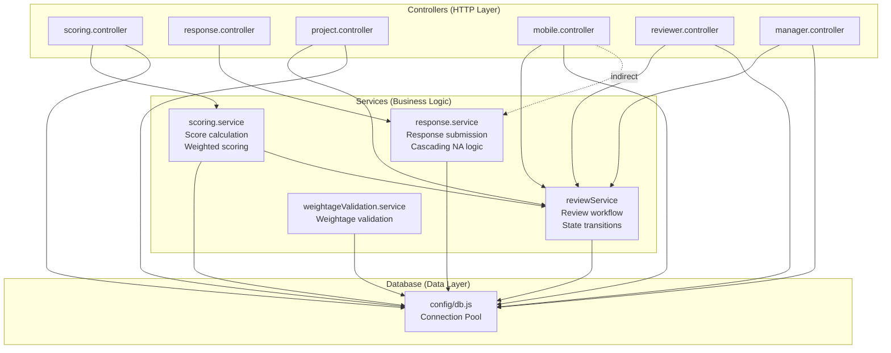
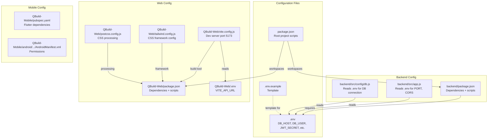
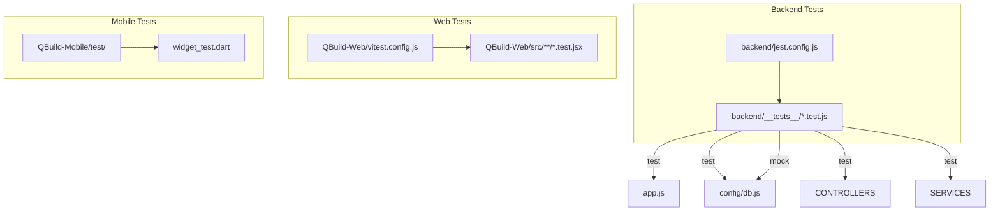
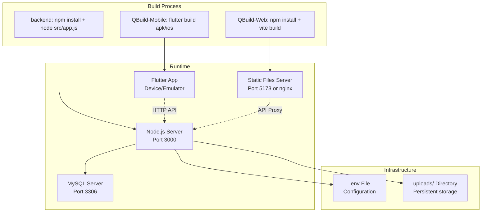

# QBuild Dependency Architecture Map (Code Relationship Diagram)

> **Purpose:** Complete impact analysis showing how every file, module, and component depends on each other. Use this to understand what breaks when you modify any piece of code.

---

## 1. MODULE DEPENDENCY GRAPH (Top-Level)

```mermaid
graph TB
    subgraph "Backend Node.js"
        APP[app.js]
        DB[config/db.js]
        AUTH[models/User.js]
        
        subgraph "Controllers"
            AC[authController]
            PC[project.controller]
            DC[domain.controller]
            SDC[sub_domain.controller]
            QC[query.controller]
            RC[response.controller]
            SC[scoring.controller]
            MC[mobile.controller]
            RVC[reviewer.controller]
            MGC[manager.controller]
        end
        
        subgraph "Services"
            SS[scoring.service]
            RS[response.service]
            RVS[reviewService]
            DS[weightageValidation.service]
        end
        
        subgraph "Routes"
            AR[auth.routes]
            PR[project.routes]
            DR[domain.routes]
            SDR[sub_domain.routes]
            QR[query.routes]
            RR[response.routes]
            SR[scoring.routes]
            MR[mobile.routes]
            RVR[reviewer.routes]
            MGR[manager.routes]
            WR[weightage.routes]
            WMR[weightageManagement.routes]
        end
        
        subgraph "Middleware"
            MW_AUTH[middleware/auth.js]
            MW_RBAC[middleware/rbac.js]
            MW_VAL[middleware/validation.js]
            MW_ERR[middleware/errorHandler.js]
        end
    end

    subgraph "Frontend Web"
        API[services/api.js]
        AX[api/axios.js]
        
        subgraph "Pages"
            PG_DASH[Dashboard]
            PG_PROJ[Projects]
            PG_PROJD[ProjectDetails]
            PG_DOM[Domains]
            PG_SD[SubDomains]
            PG_Q[Queries]
            PG_RPT[Reports]
            PG_SCORE[ScoreDashboard]
            PG_USR[UserManagement]
            PG_RVD[ReviewerDashboard]
            PG_RVIR[ReviewerInspectionReview]
            PG_MGD[ManagerDashboard]
        end
        
        subgraph "Components"
            C_LAYOUT[Layout]
            C_SPIDER[SpiderChart]
            C_PHASE[PhaseManagement]
            C_PHASEMODAL[PhaseManagementModal]
            C_CREATE[CreateInspectionForm]
            C_QUERYMODAL[QueryManagementModal]
        end
        
        subgraph "Context"
            CTX_AUTH[AuthContext]
        end
    end

    subgraph "Mobile Flutter"
        API_SVC[services/api_service.dart]
        AUTH_SVC[services/auth_service.dart]
        CACHE_SVC[services/local_cache_service.dart]
        
        subgraph "Screens"
            S_DASH[dashboard_screen]
            S_INBOX[inbox_screen]
            S_REJ[rejected_inbox_screen]
            S_LOGIN[login_screen]
            S_QUERIES[inspection_queries_screen]
        end
    end

    subgraph "Database (MySQL)"
        TB_USERS[users]
        TB_PROJ[projects]
        TB_DOM[domains]
        TB_SD[sub_domains]
        TB_DSD[domain_sub_domains]
        TB_Q[queries]
        TB_SDQ[sub_domain_queries]
        TB_PH[phases]
        TB_PD[phase_domains]
        TB_PDSD[phase_domain_sub_domains]
        TB_PQ[phase_queries]
        TB_INSP[inspections]
        TB_RESP[responses]
        TB_SDS[sub_domain_scores]
        TB_DS[domain_scores]
        TB_ISS[inspection_subdomain_submissions]
    end

    %% Backend Internal Relationships
    APP --> DB
    APP --> MW_ERR
    
    AR --> MW_AUTH
    AR --> AC
    PR --> MW_AUTH
    PR --> MW_RBAC
    PR --> PC
    DR --> MW_AUTH
    DR --> DC
    SDR --> MW_AUTH
    SDR --> SDC
    QR --> MW_AUTH
    QR --> QC
    RR --> MW_AUTH
    RR --> RC
    SR --> MW_AUTH
    SR --> SC
    MR --> MW_AUTH
    MR --> MC
    RVR --> MW_AUTH
    RVR --> MW_RBAC
    RVR --> RVC
    MGR --> MW_AUTH
    MGR --> MW_RBAC
    MGR --> MGC
    
    PC --> DB
    PC --> RVS
    SC --> SS
    SC --> DB
    MC --> DB
    MC --> RVS
    RC --> RS
    RS --> DB
    RVS --> DB
    SS --> DB
    SS --> RVS
    
    MW_AUTH --> AUTH
    MW_AUTH --> DB

    %% Frontend Internal Relationships
    PG_DASH --> CTX_AUTH
    PG_DASH --> API
    PG_PROJ --> CTX_AUTH
    PG_PROJ --> API
    PG_PROJD --> API
    PG_PROJD --> C_PHASEMODAL
    PG_DOM --> CTX_AUTH
    PG_DOM --> API
    PG_SD --> CTX_AUTH
    PG_SD --> API
    PG_Q --> CTX_AUTH
    PG_Q --> API
    PG_RVD --> CTX_AUTH
    PG_RVD --> API
    PG_MGD --> CTX_AUTH
    PG_MGD --> API
    
    C_LAYOUT --> CTX_AUTH
    C_LAYOUT --> API
    C_PHASEMODAL --> C_PHASE
    C_PHASEMODAL --> C_CREATE
    C_CREATE --> API
    C_CREATE --> C_QUERYMODAL
    C_SPIDER --> API
    CTX_AUTH --> API
    
    API --> AX

    %% Mobile Internal Relationships
    S_DASH --> API_SVC
    S_DASH --> AUTH_SVC
    S_INBOX --> API_SVC
    S_REJ --> API_SVC
    S_LOGIN --> AUTH_SVC
    S_QUERIES --> API_SVC
    S_QUERIES --> CACHE_SVC
    API_SVC --> AUTH_SVC

    %% Backend to Database
    DB --> TB_USERS
    DB --> TB_PROJ
    DB --> TB_DOM
    DB --> TB_SD
    DB --> TB_DSD
    DB --> TB_Q
    DB --> TB_SDQ
    DB --> TB_PH
    DB --> TB_PD
    DB --> TB_PDSD
    DB --> TB_PQ
    DB --> TB_INSP
    DB --> TB_RESP
    DB --> TB_SDS
    DB --> TB_DS
    DB --> TB_ISS

    %% Frontend to Backend (API calls)
    PG_DASH -.->|GET /api/projects| PC
    PG_PROJ -.->|CRUD /api/projects| PC
    PG_PROJD -.->|GET /api/projects/:id| PC
    PG_PROJD -.->|GET /api/projects/:id/phases| PC
    PG_DOM -.->|CRUD /api/domains| DC
    PG_DOM -.->|GET /api/weightage-management| WMR
    PG_SD -.->|CRUD /api/sub_domains| SDC
    PG_SD -.->|GET /api/queries/sub-domain/:id| QC
    PG_Q -.->|CRUD /api/queries| QC
    PG_SCORE -.->|GET /api/scoring/:id| SC
    PG_RVD -.->|GET /api/reviewer/dashboard| RVC
    PG_MGD -.->|GET /api/manager/dashboard| MGC
    
    C_PHASE -.->|GET /api/projects/:id/phases| PC
    C_PHASEMODAL -.->|POST /api/projects/:id/phases| PC
    C_CREATE -.->|POST /api/projects/:id/phases| PC
    C_CREATE -.->|GET /api/users| PC
    C_CREATE -.->|GET /api/domains| DC
    C_CREATE -.->|GET /api/sub_domains| SDC

    %% Mobile to Backend
    S_DASH -.->|GET /api/mobile/dashboard| MC
    S_INBOX -.->|GET /api/mobile/inbox| MC
    S_QUERIES -.->|GET /api/mobile/inspections/:id/domains| MC
    S_QUERIES -.->|POST /api/mobile/inspections/:id/queries/:qid/response| MC
    S_QUERIES -.->|POST /api/mobile/inspections/:id/subdomains/:sd/submit| MC
```



---

## 2. BACKEND DEPENDENCY TREE (File-Level Imports)

### `app.js` — Entry Point

```
app.js
├── dotenv
├── express
├── cors
├── helmet ────────────────╮ (currently disabled)
├── morgan                 │
├── express-rate-limit ────╯ (currently disabled)
├── compression
├── path
├── ./config/db.js
│   ├── dotenv
│   └── mysql2/promise
├── ./utils/logger
│   └── winston
├── ./middleware/errorHandler
├── ./routes/auth.routes
│   ├── ./middleware/auth.js (JWT verify)
│   │   ├── ./models/User
│   │   └── ./config/db.js
│   ├── ./middleware/rbac.js
│   └── ./controllers/authController
│       └── ./config/db.js
├── ./routes/project.routes (same pattern for all route files)
├── ./routes/domain.routes
├── ./routes/sub_domain.routes
├── ./routes/query.routes
├── ./routes/response.routes
├── ./routes/scoring.routes
├── ./routes/mobile.routes
├── ./routes/reviewer.routes
├── ./routes/manager.routes
└── ./routes/weightage.routes
```

### Critical Import Chain: Scoring Feature (Highest Impact)

```
routes/scoring.routes
└── ../controllers/scoring.controller.js
    └── ../services/scoring.service.js
        ├── ../config/db.js
        │   ├── dotenv
        │   └── mysql2/promise
        └── ../utils/logger
            └── winston
```

### Critical Import Chain: Mobile Feature (Highest Complexity)

```
routes/mobile.routes
└── ../controllers/mobile.controller.js
    ├── ../config/db.js
    ├── ../utils/logger
    ├── fs
    └── path
```

### Critical Import Chain: Response Submission

```
routes/response.routes
└── ../controllers/response.controller.js
    └── ../services/response.service.js
        ├── ../config/db.js
        └── ../utils/logger
```

---

## 3. FRONTEND DEPENDENCY TREE (Web)

### Component Import Hierarchy

```
App.jsx
├── ./context/AuthContext.jsx
│   ├── react (createContext, useContext)
│   └── ./services/api.js
│       └── ./api/axios.js
│           └── axios
├── ./routes/AppRoutes.jsx
│   ├── react-router-dom
│   ├── ./context/AuthContext.jsx
│   ├── ./pages/Login.jsx
│   ├── ./pages/Dashboard.jsx
│   ├── ./pages/Projects.jsx
│   ├── ./pages/ProjectDetails.jsx
│   │   └── ./components/PhaseManagementModal.jsx
│   │       ├── ./components/PhaseManagement.jsx
│   │       │   └── ./services/api.js
│   │       └── ./components/CreateInspectionForm.jsx
│   │           ├── ./services/api.js
│   │           ├── react-toastify
│   │           └── ./components/QueryManagementModal.jsx
│   ├── ./pages/Domains.jsx
│   │   └── ./services/api.js
│   │       └── ./styles/Domains.css
│   ├── ./pages/SubDomains.jsx → /styles/SubDomains.css
│   ├── ./pages/Queries.jsx → /styles/Queries.css
│   ├── ./pages/ScoreDashboard.jsx
│   ├── ./pages/Reports.jsx
│   ├── ./pages/UserManagement.jsx
│   ├── ./pages/ReviewerDashboard.jsx
│   ├── ./pages/ReviewerInspectionReview.jsx
│   ├── ./pages/ManagerDashboard.jsx
│   └── ./pages/ManagerInspectionReview.jsx
├── ./components/Layout.jsx
│   ├── ./hooks/useAuth.js
│   │   └── ./context/AuthContext.jsx
│   ├── react-router-dom
│   └── ./styles/Layout.css
└── ./components/SpiderChart.jsx
    └── recharts
```

### Stylesheet Dependencies

```
src/main.jsx
└── ./index.css (global styles + Tailwind)

Each page/component imports its own CSS:
├── ./styles/Domains.css
├── ./styles/SubDomains.css
├── ./styles/Login.css
├── ./styles/Layout.css
├── ./styles/Dashboard.css
├── ./styles/Projects.css
├── ./styles/Inspections.css
├── ./styles/Reports.css
├── ./styles/Queries.css
├── ./styles/ManagerDashboard.css
└── ./styles/ReviewerDashboard.css
```

---

## 4. API DEPENDENCY MAP (Endpoint ↔ Controller ↔ Service ↔ Table)

### Authentication
| Endpoint | Controller | Service | Tables |
|----------|-----------|---------|--------|
| `POST /api/auth/login` | `authController.login` | Direct SQL | `users` |
| `POST /api/auth/register` | `authController.register` | Direct SQL | `users` |

### Projects
| Endpoint | Controller | Service | Tables |
|----------|-----------|---------|--------|
| `GET /api/projects` | `project.controller.getProjects` | Direct SQL | `projects`, `inspections` |
| `GET /api/projects/:id` | `project.controller.getProject` | Direct SQL | `projects` |
| `POST /api/projects` | `project.controller.createProject` | Direct SQL | `projects` |
| `GET /api/projects/:id/phases` | `project.controller.getProjectPhases` | Direct SQL | `phases`, `phase_domains`, `phase_domain_sub_domains` |
| `POST /api/projects/:id/phases` | `project.controller.createPhase` | `reviewService` | `phases`, `inspections`, `phase_domains`, `phase_domain_sub_domains`, `phase_queries` |
| `GET /api/projects/:id/phases/:phase/configuration` | `project.controller.getPhaseConfiguration` | Direct SQL | `phases`, `phase_domains`, `phase_domain_sub_domains`, `phase_queries`, `queries` |
| `GET /api/projects/:id/spider-chart` | `project.controller.getProjectSpiderChart` | `scoringService` | `sub_domain_scores`, `domain_scores` |

### Domains
| Endpoint | Controller | Service | Tables |
|----------|-----------|---------|--------|
| `GET /api/domains` | `domain.controller.getDomains` | Direct SQL | `domains` |
| `POST /api/domains` | `domain.controller.createDomain` | Direct SQL | `domains` |
| `PUT /api/domains/:id` | `domain.controller.updateDomain` | Direct SQL | `domains` |
| `DELETE /api/domains/:id` | `domain.controller.deleteDomain` | Direct SQL | `domains` |

### Weightage Management
| Endpoint | Controller | Service | Tables |
|----------|-----------|---------|--------|
| `GET /api/weightage-management/domain-sub-domains` | Weightage Management | Direct SQL | `domain_sub_domains`, `sub_domains` |
| `POST /api/weightage-management/domain-sub-domains/:domainId/:subDomainId` | Weightage Management | Direct SQL | `domain_sub_domains` |
| `DELETE /api/weightage-management/domain-sub-domains/:domainId/:subDomainId` | Weightage Management | Direct SQL | `domain_sub_domains` |

### Responses
| Endpoint | Controller | Service | Tables |
|----------|-----------|---------|--------|
| `POST /api/responses/inspection/:id` | `response.controller.bulkSubmit` | `responseService.bulkSubmitResponses` | `responses`, `inspections`, `phases` |
| `GET /api/responses/inspection/:id` | `response.controller.getByInspection` | `responseService.getResponsesByInspection` | `responses` |

### Scoring
| Endpoint | Controller | Service | Tables |
|----------|-----------|---------|--------|
| `GET /api/scoring/:inspectionId/calculate` | `scoring.controller.calculateScore` | `scoringService.calculateInspectionScore` | `inspections`, `phase_domains`, `phase_domain_sub_domains`, `phase_queries`, `queries`, `sub_domain_queries`, `responses`, `sub_domain_scores`, `domain_scores` |
| `GET /api/scoring/:inspectionId/spider-chart` | `scoring.controller.getSpiderChartData` | `scoringService` | `sub_domain_scores`, `domain_scores` |

### Mobile API (High Complexity)
| Endpoint | Controller | Tables |
|----------|-----------|--------|
| `GET /api/mobile/dashboard` | `mobile.controller.getDashboard` | `inspections`, `projects` |
| `GET /api/mobile/inbox` | `mobile.controller.getInbox` | `inspections`, `projects` |
| `GET /api/mobile/inspections/:id/domains` | `mobile.controller.getInspectionDomains` | `inspections`, `projects`, `phase_domains`, `domains`, `phase_domain_sub_domains`, `sub_domains`, `inspection_subdomain_submissions` |
| `GET /api/mobile/inspections/:id/domains/:dId/subdomains/:sdId/queries` | `mobile.controller.getSubDomainQueries` | `phase_queries`, `project_queries`, `queries`, `sub_domain_queries`, `responses`, `inspections` |
| `POST /api/mobile/inspections/:id/queries/:qId/response` | `mobile.controller.submitQueryResponse` | `responses`, `inspections` |
| `POST /api/mobile/inspections/:id/subdomains/:sdId/submit` | `mobile.controller.submitSubDomain` | `responses`, `inspection_subdomain_submissions`, `sub_domain_queries` |
| `POST /api/mobile/inspections/:id/submit` | `mobile.controller.submitFinalInspection` | `inspections`, `phases`, `inspection_subdomain_submissions` |

---

## 5. DATABASE DEPENDENCY GRAPH (Foreign Key Relationships)

```mermaid
graph TB
    %% Foreign Key relationships
    subgraph "Core Tables"
        USERS[users<br/>id, email, password_hash, role]
        PROJ[projects<br/>id, project_name, inspector_id, created_by]
        DOM[domains<br/>id, domain_name, is_active]
        SD[sub_domains<br/>id, sub_domain_name]
        Q[queries<br/>id, question_text]
    end

    subgraph "Mapping Tables"
        DSD[domain_sub_domains<br/>domain_id, sub_domain_id, weightage]
        SDQ[sub_domain_queries<br/>sub_domain_id, query_id, query_type, parent_id]
    end

    subgraph "Phase Configuration"
        PH[phases<br/>id, project_id, phase_number, inspector_id]
        PD[phase_domains<br/>project_id, phase_number, domain_id, weightage]
        PDSD[phase_domain_sub_domains<br/>project_id, phase_number, domain_id, sub_domain_id, weightage]
        PQ[phase_queries<br/>project_id, phase_number, query_id]
    end

    subgraph "Inspection Data"
        INSP[inspections<br/>id, project_id, phase, inspector_id, reviewer_id]
        RESP[responses<br/>inspection_id, query_id, domain_id, sub_domain_id, response]
        ISS[inspection_subdomain_submissions<br/>inspection_id, sub_domain_id, domain_id]
    end

    subgraph "Score Data"
        SDS[sub_domain_scores<br/>inspection_id, sub_domain_id, domain_id, secured_points, max_points]
        DS[domain_scores<br/>inspection_id, domain_id, percentage]
    end

    %% Foreign Key Arrows (source --> target)
    PROJ -->|inspector_id FK| USERS
    PROJ -->|created_by FK| USERS
    
    DSD -->|domain_id FK| DOM
    DSD -->|sub_domain_id FK| SD
    
    SDQ -->|sub_domain_id FK| SD
    SDQ -->|query_id FK| Q
    SDQ -->|parent_id FK| SDQ
    
    PH -->|project_id FK| PROJ
    PH -->|inspector_id FK| USERS
    PH -->|reviewer_id FK| USERS
    
    PD -->|project_id FK| PROJ
    PD -->|domain_id FK| DOM
    
    PDSD -->|domain_id FK| DOM
    PDSD -->|sub_domain_id FK| SD
    
    PQ -->|query_id FK| Q
    
    INSP -->|project_id FK| PROJ
    INSP -->|inspector_id FK| USERS
    
    RESP -->|inspection_id FK| INSP
    RESP -->|query_id FK| Q
    
    ISS -->|inspection_id FK| INSP
    ISS -->|sub_domain_id FK| SD
    ISS -->|domain_id FK| DOM
    
    SDS -->|inspection_id FK| INSP
    SDS -->|sub_domain_id FK| SD
    
    DS -->|inspection_id FK| INSP
    DS -->|domain_id FK| DOM
```



---

## 6. IMPACT ANALYSIS MATRIX

### What breaks when you modify each component?

| Modified Component | Direct Impact | Cascading Impact | Risk Level |
|-------------------|---------------|------------------|------------|
| **`config/db.js`** | All controllers (19 files) | All services, all routes | 🔴 CRITICAL |
| **`scoring.service.js`** | `scoring.controller.js`, spider chart endpoints | Reports, dashboards | 🔴 HIGH |
| **`response.service.js`** | `response.controller.js` | Mobile submission, web submission | 🔴 HIGH |
| **`auth.js` middleware** | All protected routes (18 route files) | All authenticated endpoints | 🔴 CRITICAL |
| **`rbac.js` middleware** | All admin/manager/reviewer routes | Access control for all roles | 🔴 HIGH |
| **`mobile.controller.js`** | Mobile API endpoints (12+ endpoints) | Flutter app functionality | 🔴 HIGH |
| **`reviewService.js`** | Reviewer + manager controllers | Approval/rejection workflows | 🟡 MEDIUM |
| **Database schema (any table)** | Services that query that table | Controllers → API responses → Frontend | 🔴 HIGH |
| **`responses` table schema** | `response.service.js`, `scoring.service.js` | Mobile submission, scoring | 🔴 CRITICAL |
| **`sub_domain_scores` / `domain_scores`** | `scoring.service.js` | Spider charts, reports | 🟡 MEDIUM |
| **`Layout.jsx`** (sidebar) | All pages wrapped in Layout | Navigation for all users | 🟡 MEDIUM |
| **`AuthContext.jsx`** | All pages using `useAuth()` | Login, role-based rendering | 🔴 HIGH |
| **`api.js`** (Axios) | All API service objects (domainApi, etc.) | All frontend API calls | 🔴 CRITICAL |
| **SpiderChart.jsx** | Reports, ScoreDashboard, ProjectDetails | Chart visualizations | 🟢 LOW |
| **CreateInspectionForm.jsx** | PhaseManagementModal | Phase creation flow | 🟡 MEDIUM |
| **PhaseManagementModal.jsx** | ProjectDetails | Phase management UI | 🟢 LOW |

---

## 7. SERVICE LAYER INTERDEPENDENCIES



---

## 8. DATABASE TABLE DEPENDENCY MAP (Read/Write Matrix)

| Table | Created By | Read By | Written By | Affected Endpoints |
|-------|-----------|---------|------------|-------------------|
| `users` | authController | authController, project.controller, user management | authController, user management | `/api/auth/*`, `/api/users/*` |
| `projects` | project.controller | project.controller | project.controller | `/api/projects/*` |
| `domains` | domain.controller | domain.controller, weightageManagement | domain.controller, weightageManagement | `/api/domains/*`, `/api/weightage-management/*` |
| `sub_domains` | sub_domain.controller | sub_domain.controller, mobile.controller, weightageManagement, scoring.service | sub_domain.controller, weightageManagement | `/api/sub_domains/*`, mobile API, scoring |
| `domain_sub_domains` | weightageManagement | weightageManagement, mobile.controller, scoring.service | weightageManagement, domain.controller | `/api/weightage-management/*`, domains page |
| `queries` | query.controller | query.controller, mobile.controller, scoring.service | query.controller | `/api/queries/*`, mobile API, scoring |
| `sub_domain_queries` | query.controller | query.controller, scoring.service, mobile.controller | query.controller | `/api/queries/*`, scoring |
| `phases` | project.controller | project.controller, mobile.controller | project.controller | `/api/projects/:id/phases`, mobile API |
| `phase_domains` | project.controller | project.controller, scoring.service, mobile.controller | project.controller | Phase configuration, scoring |
| `phase_domain_sub_domains` | project.controller | project.controller, scoring.service, mobile.controller | project.controller | Phase configuration, scoring |
| `phase_queries` | project.controller | scoring.service, mobile.controller | project.controller | Phase configuration, scoring |
| `inspections` | project.controller, mobile.controller | project.controller, mobile.controller, reviewer.controller, manager.controller, scoring.service, response.service | project.controller, mobile.controller, reviewer.controller, manager.controller | Multiple endpoints |
| `responses` | mobile.controller, response.controller | mobile.controller, scoring.service, response.controller | mobile.controller, response.controller | Mobile API, scoring |
| `sub_domain_scores` | scoring.service | scoring.controller, project.controller | scoring.service | `/api/scoring/*`, spider chart |
| `domain_scores` | scoring.service | scoring.controller, project.controller | scoring.service | `/api/scoring/*`, spider chart |
| `inspection_subdomain_submissions` | mobile.controller | mobile.controller, project.controller | mobile.controller | Mobile API |

---

## 9. FLUTTER MOBILE DEPENDENCY TREE

```
lib/
├── main.dart
│   ├── services/auth_service.dart
│   ├── services/api_service.dart
│   ├── providers/ (via ChangeNotifierProvider)
│   └── screens/ (via GoRouter)
│       ├── login_screen.dart
│       │   └── services/auth_service.dart
│       ├── dashboard_screen.dart
│       │   ├── services/api_service.dart
│       │   └── services/auth_service.dart
│       ├── inbox_screen.dart
│       │   └── services/api_service.dart
│       ├── rejected_inbox_screen.dart
│       │   └── services/api_service.dart
│       └── inspection_queries_screen.dart
│           ├── services/api_service.dart
│           └── services/local_cache_service.dart
├── services/
│   ├── api_service.dart
│   │   ├── services/auth_service.dart
│   │   └── package:http
│   ├── auth_service.dart
│   │   └── package:shared_preferences
│   └── local_cache_service.dart
│       └── package:shared_preferences
└── utils/
    └── constants.dart (AppColors, AppStrings)
```

---

## 10. CONFIGURATION DEPENDENCY MAP



---

## 11. TEST DEPENDENCY MAP



---

## 12. DEPLOYMENT DEPENDENCY MAP



---

## 13. IMPACT ANALYSIS SUMMARY

| Layer | File Count | Dependencies | Risk Score |
|-------|-----------|-------------|------------|
| **Database Config** | 1 (db.js) | 19 controllers, 5 services | **10/10** |
| **Auth Middleware** | 1 (auth.js) | All 18 route files | **10/10** |
| **API Client (Web)** | 1 (api.js) | All 13 pages + components | **10/10** |
| **Mobile Controller** | 1 | 12+ mobile endpoints, Flutter app | **9/10** |
| **Scoring Service** | 1 | 3 controllers, reports, charts | **8/10** |
| **Response Service** | 1 | 2 controllers, mobile submission | **8/10** |
| **Database Schema** | 17 tables | All services, all controllers | **9/10** |
| **Frontend Layout** | 1 | All pages (shared sidebar) | **5/10** |
| **Auth Context** | 1 | All frontend pages | **7/10** |
| **Spider Chart** | 1 | 2-3 pages | **3/10** |