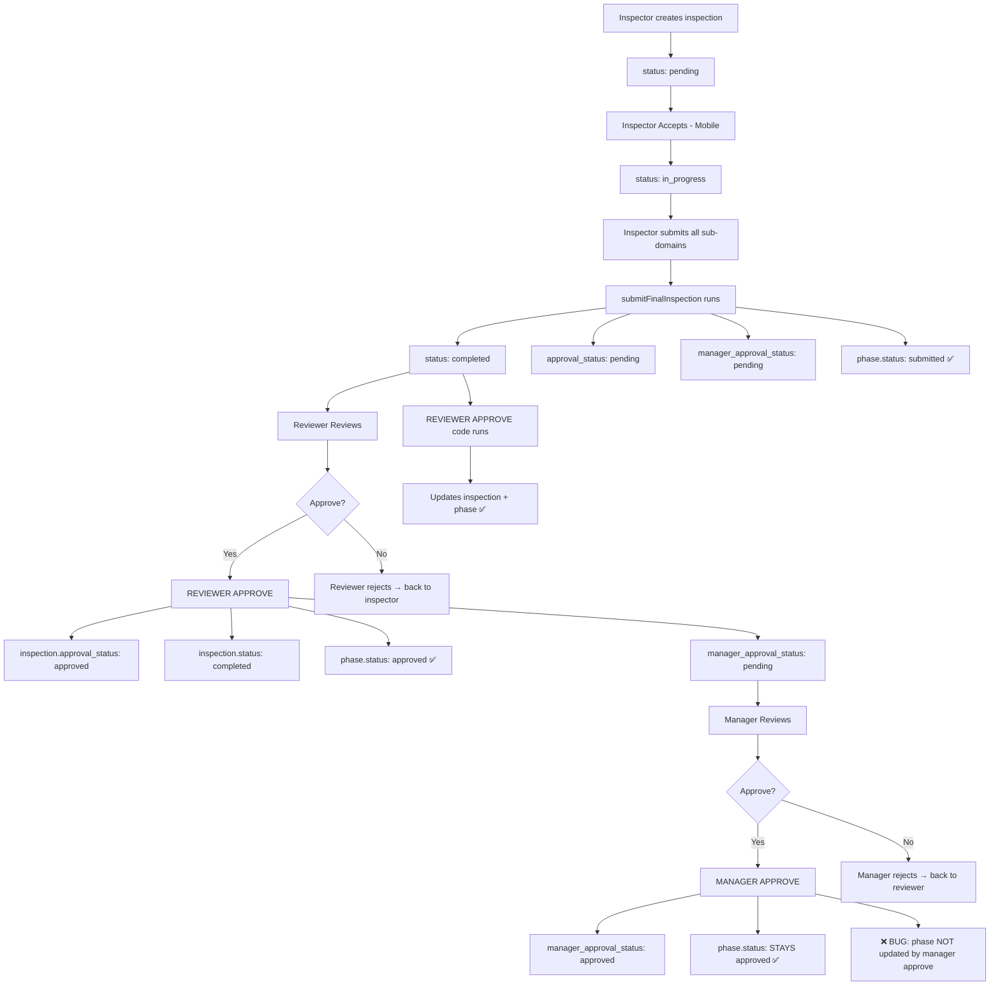

# Inspection Status Analysis — Complete Workflow & Bug Report

## Current Database State (Project "ok" — id=144)

### Inspections Table

| id | phase | status | approval_status | manager_approval_status | Meaning |
|----|-------|--------|----------------|--------------------------|---------|
| 148 | 1 | completed | approved | approved | ✅ Fully approved |
| 149 | 2 | pending | pending | pending | ⏳ Not started |

### Phases Table

| id | phase_number | status | Meaning |
|----|-------------|--------|---------|
| 118 | 1 | **submitted** | ❌ Should be "approved" |
| 120 | 2 | pending | Correct |

## The Status Problem

**Phase 118 has `status='submitted'` even though inspection 148 is fully approved (both reviewer AND manager).**

---

## Complete Workflow & Where It Breaks



## Bugs Found

### Bug 1: Phase Status Not Updated on Manager Approval
**File:** `backend/src/workflow/reviewWorkflow.js`, lines 107-117

```javascript
if (role === 'manager') {
  // Manager approval flow
  await connection.execute(
    `UPDATE inspections
     SET manager_approval_status = 'approved', ...`,
    [...]
  );
  // ⚠️ NO phase status update here!
}
```

When the manager approves, the phase status is **never updated**. It stays at whatever the reviewer set it to. If some edge case caused the phase to revert to "submitted" (e.g., a `submitFinalInspection` call after review), it would stay "submitted" forever since manager approval doesn't touch it.

**Fix:** Add phase status update in manager approval:
```javascript
await connection.execute(
  `UPDATE phases SET status = 'approved', updated_at = NOW()
   WHERE project_id = ? AND phase_number = ?`,
  [projectId, phase]
);
```

### Bug 2: Manager sets `status = 'completed'` but this was already set
**File:** `backend/src/workflow/reviewWorkflow.js`, line 108-117

When manager approves, the inspection `status` is NOT re-set to "completed" — it was already set by reviewer. This is actually correct for the inspection table but the **phase** needs the same treatment.

### Bug 3: `submitFinalInspection` can revert phase to "submitted" even after approval
**File:** `backend/src/controllers/mobile.controller.js`, lines 941-953

```javascript
`UPDATE phases SET status = 'submitted', ... WHERE project_id = ? AND phase_number = ?`,
```

If `submitFinalInspection` is called again (e.g., during a re-submission flow), it would **re-set phase status back to "submitted"** even after it was "approved". The workflow then relies on the reviewer approval to set it to "approved" again, but if manager approval comes first, it stays "submitted".

### Bug 4: Dashboard may be counting phase.status instead of inspection status
If the dashboard query at the frontend counts phases where `status = 'submitted'`, it would show "Submitted: 1" even though the inspection is fully approved.

---

## Expected vs Actual Status Flow

| Step | inspection.status | inspection.approval_status | inspection.manager_approval_status | phase.status |
|------|------------------|--------------------------|----------------------------------|-------------|
| Created | pending | pending | pending | pending |
| Inspector accepts | in_progress | pending | pending | in_progress |
| Inspector submits all | **completed** | **pending** | **pending** | **submitted** |
| Reviewer approves | completed | **approved** | pending | **approved** |
| Manager approves | completed | approved | **approved** | ⚠️ **Still approved** (but bug leaves it at "submitted" if prior state was wrong) |

## Recommended Fixes

### Fix 1: Update phase on manager approval
In `reviewWorkflow.js`, add phase update to the manager approval block:

```javascript
if (role === 'manager') {
  await connection.execute(
    `UPDATE inspections SET manager_approval_status = 'approved', ... WHERE id = ?`,
    [...]
  );
  // Add this:
  await connection.execute(
    `UPDATE phases SET status = 'approved', updated_at = NOW()
     WHERE project_id = ? AND phase_number = ?`,
    [projectId, phase]
  );
}
```

### Fix 2: Prevent `submitFinalInspection` overwriting approved status
In `mobile.controller.js`, check if the phase is already "approved" before setting it to "submitted":

```javascript
// Before line 947, check current phase status
const currentPhase = await db.execute(
  `SELECT status FROM phases WHERE project_id = ? AND phase_number = ?`,
  [projectId, phase]
);
if (currentPhase[0]?.status !== 'approved') {
  // Only set to submitted if not already approved
  await connection.execute(
    `UPDATE phases SET status = 'submitted', ...`,
    [...]
  );
}